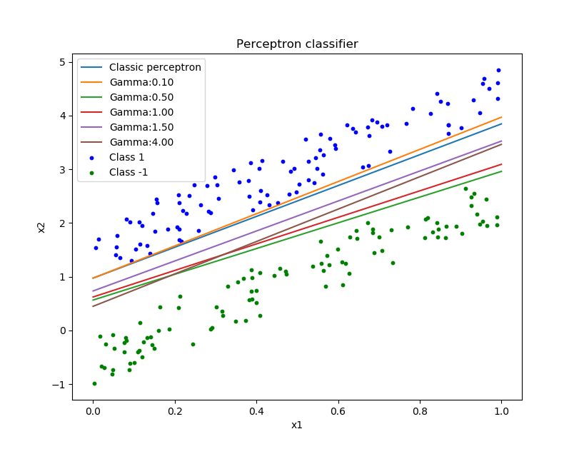

PRHW\_04\_SVM
=============

### 李洪军，2017310864

------------------------------------------------------------------------

经典感知器的训练过程可以看成在解区内寻找一个解，并没有对这个解的性能有所限定。这个解只需满足，其中是感知器的权向量，是规范化增广样本向量。
而margin
感知器则要求算法收敛的超平面有一个大于
的margin，其中
是预先设定的一个正数。即，margin 感知器的解需要满足
。

因此，在 margin
感知器的训练中，“错误”包括两种情况：1）标签预测错误（prediction
mistake）；2）标签预测正确但 margin 不够大（margin mistake）。

-   随机生成200个二维平面上的点，其中100个标记为1，剩下的100
    个标记为-1，保证它们是线性可分的。画出这200个点的分布。
-   编程实现经典感知器算法，并在生成的数据集上运行。在一张图上画出分界线和数据点。
-   编程实现margin
    感知器算法，并在生成的数据集上运行。在一张图上画出分界线和数据点，分析
    取值对算法收敛性及分界面位置的影响。

------------------------------------------------------------------------

### Answer

#### 说明

代码在 `./2d_margin_perceptron.py`
由`python3`编写，使用了`numpy`库进行随机数生成和矩阵运算，使用了`matplotlib`库进行结果可视化。

#### 结果

经典感知器算法和margin感知器算法结果合并如图:

#### 分析

对于经典感知器来说，由于没有间隔的限制，只要求对两类点进行正确的分类即可，因此很可能出现对训练样本的过拟合而使在样本出现一定的噪声下分类错误。结果也说明了这一点，某些正类样本和分界线几乎无间隔，这种情况下对这些样本来说无法容噪声。

对于margin感知器来说，由于其约束了样本到分界线的间隔，固可以一定程度上解决经典感知器泛化能力不强的缺陷。从结果可以看到，当间隔的设置很小(
=
0.1)时，其性能和经典感知器相差不大，但随着间隔设置的增加，分界线与两类样本所有点最近距离都在增加，在时，分界线已经几乎是最优分解线。

总结，经典感知器算法简单易于实现，但容易出现过拟合问题。margin感知器通过引入间隔限制增加了其泛化能力。
